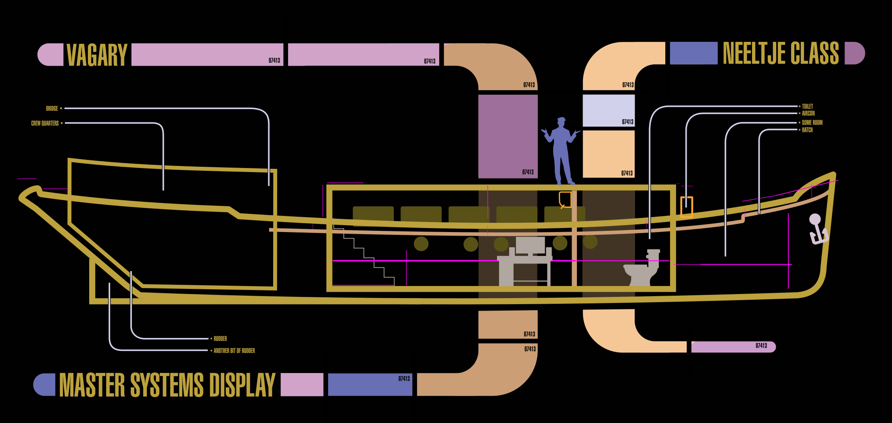

## Vagary Data Retreival

Vagary library files are stored as a series of R Markdown encoded files.
These can contain text, images and interactive charts and controls.

There is a useful post [here](https://stackoverflow.com/questions/37121767/svg-with-clickable-links-in-shiny-not-clickable) about including svg files with clickable links. 

That might be a good way of rendering the MSD.

The next thing to figure out is how to do these .rmd files as a wiki.

I asked a question [here](https://stackoverflow.com/questions/62354378/linking-included-rmd-files-inside-a-shiny-app)

[test](panels/library/lib_index.rmd)

#